## HYPERVISORS

# 1. What are the most popular hypervisors for infrastructure virtualization?
- Hyper-V.
- Azure Virtual Machines.
- VMware Workstation.
- Oracle VM.

# 2. Briefly describe the main differences of the most popular hypervisors.

 - Type 1:  Runs  directly on hardware components, doesn't have it's own OS. Mostly used in servers segment.
 - Type 2:  Runs on top of another OS. Used mostly for "personal" use. 

 ## WORK WITH VIRTUALBOX

 # 1.3 Create VM1 and install Ubuntu using the instructions [1, chapter 1.8]. Set machine name as "host machine name"_"student last name"

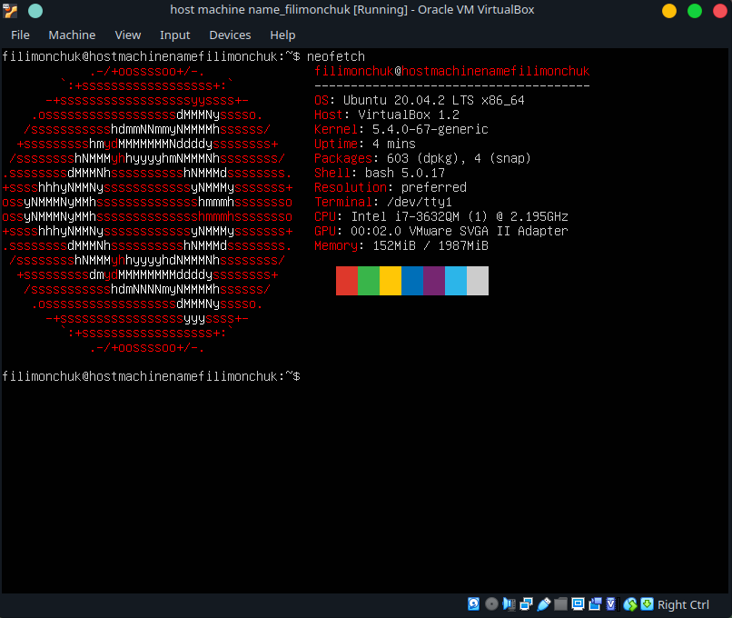

# 1.5 Clone an existing VM1 by creating a VM2 [1, ch.1.14].

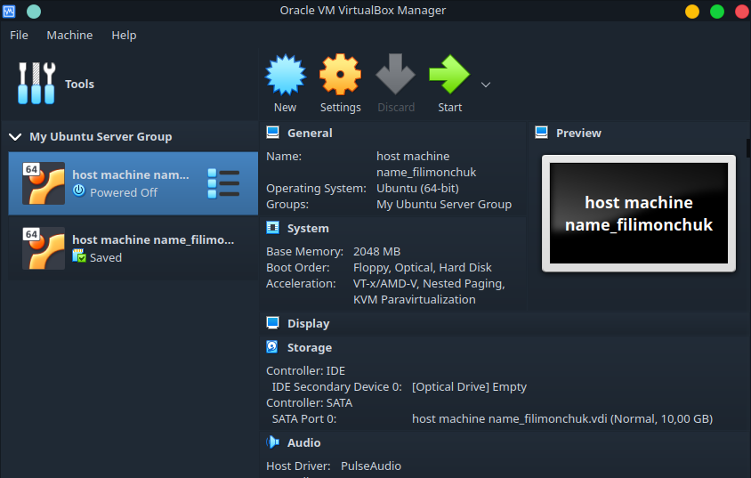

# 1.6 Create a group of two VM: VM1, VM2 and learn the functions related to groups [1, ch.1.10].

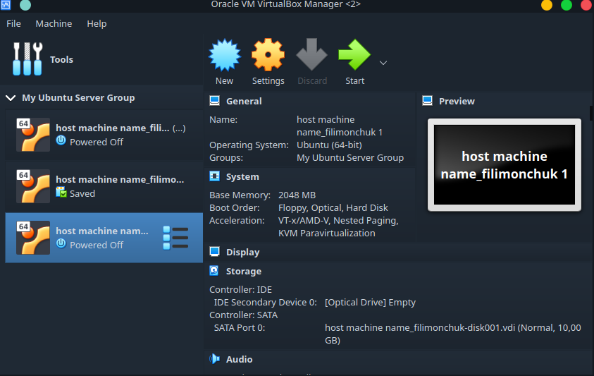

# 1.7 For VM1, changing its state, take several different snapshots, forming a branched tree of snapshots [1, ch.1.11].

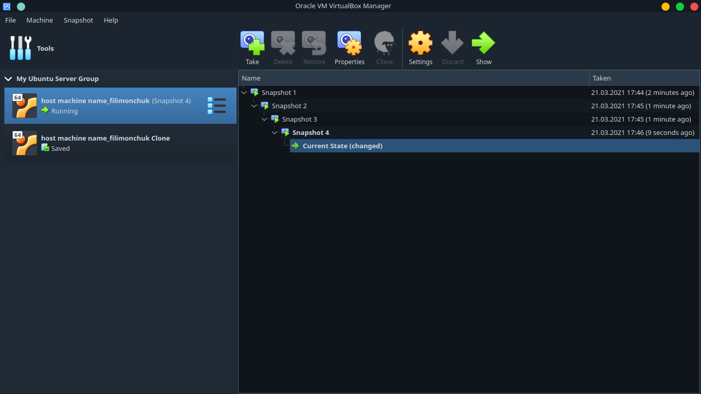

# 1.8 Export VM1. Save the *.ova file to disk. Import VM from *.ova file [1, ch.1.15].
 
 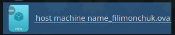

 # 2.3 Configure a shared folder to exchange data between the virtual machine and the host [1, ch.4.3].

 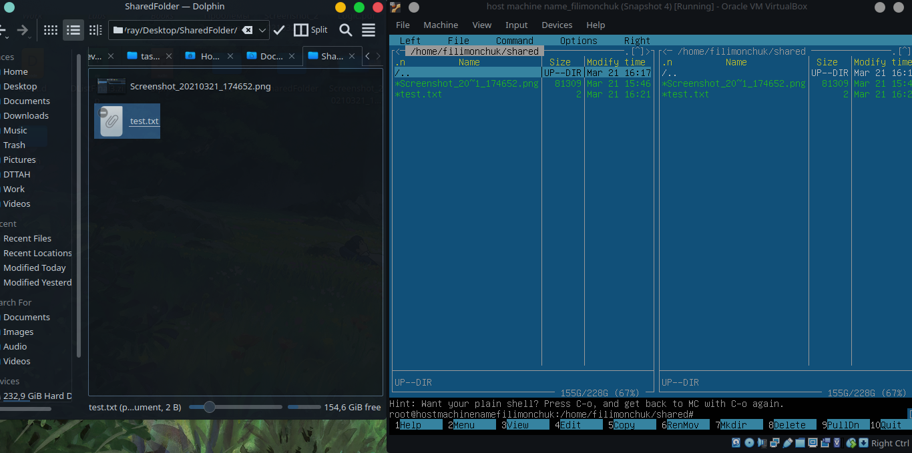

# 2.4 Configure different network modes for VM1, VM2. Check the connection between VM1, VM2, Host, Internet for different network modes. You can use the ping command to do this. Make a table of possible connections.

 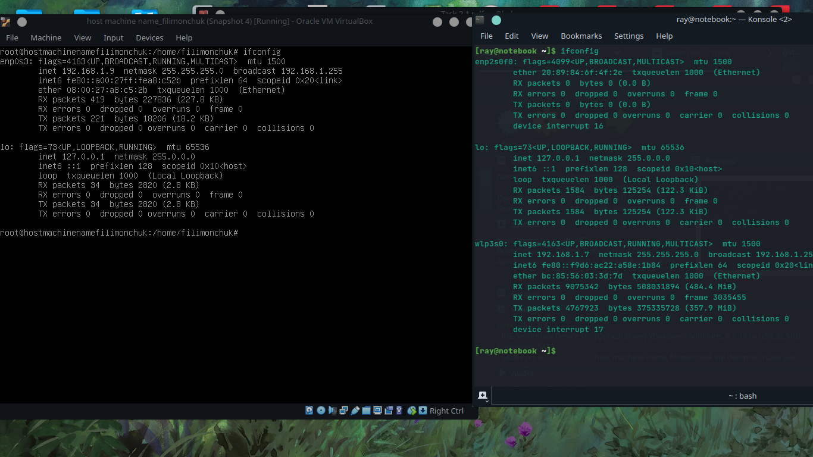
 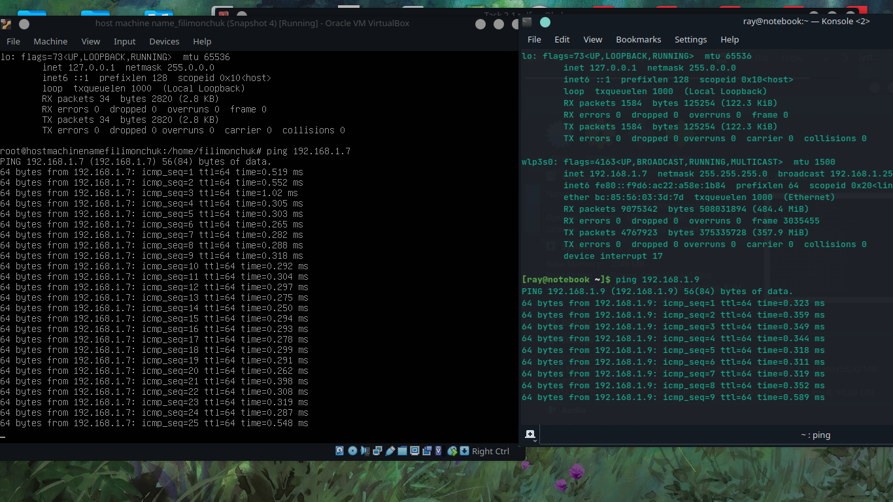

# 3. Work with CLI through VBoxManage.
 
  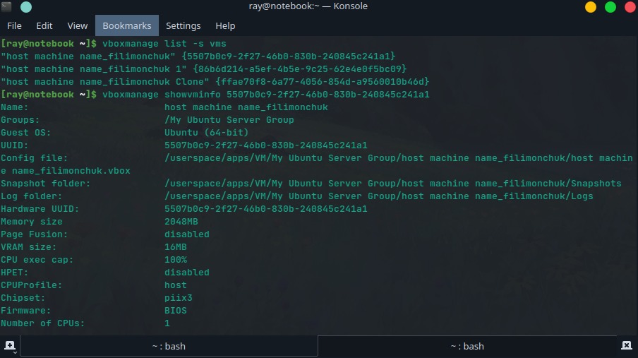

  ## WORK WITH VAGRANT

# 3. Initialize the environment with the default Vagrant init hashicorp/precise64

  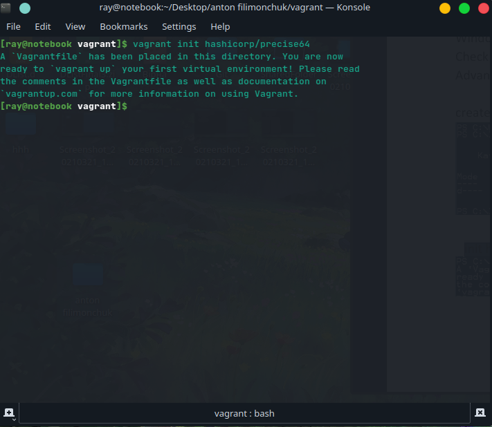

  # 4. Run vagrant up and watch for messages during VM boot and startup.

 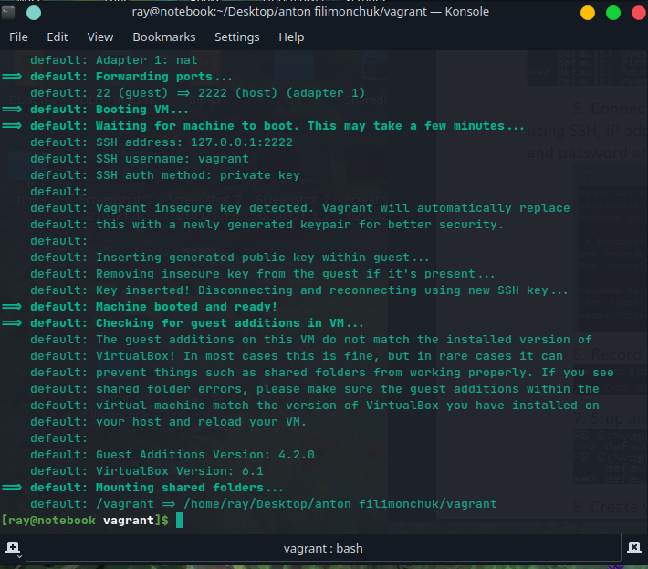

# 6. Record the date and time by executing the date command

 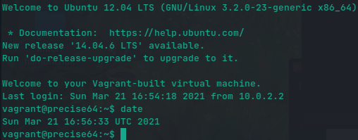

 # 8. Create your own Vagrant box [7]

 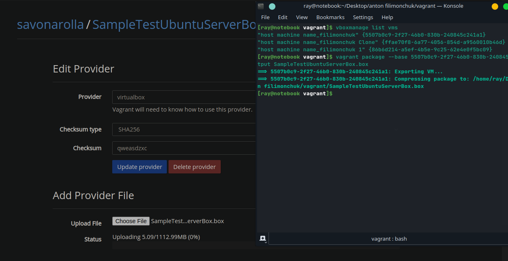
