 ## Module 2 Virtualization and Cloud Basic

# TASK 2.2

# 4. Review the 10-minute example Launch a Linux Virtual Machine with Amazon Lightsail.

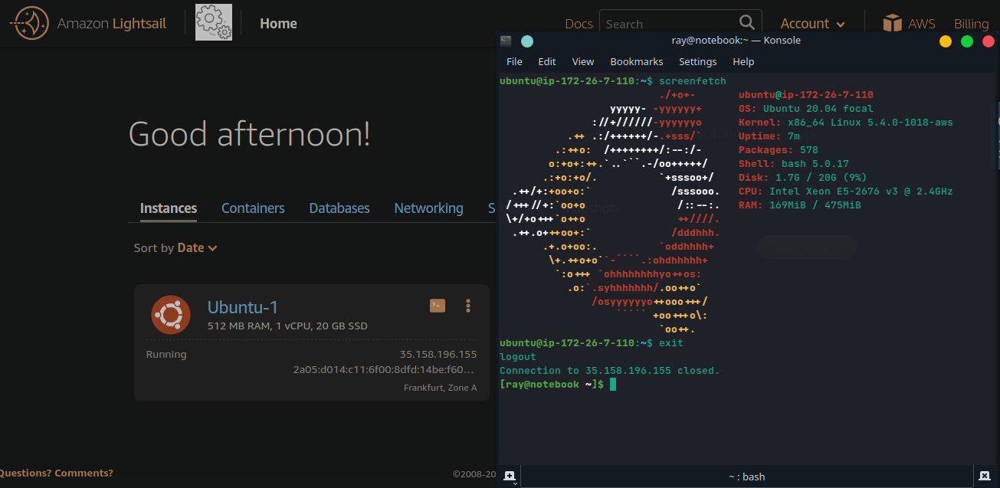

# 5. Launch another Linux Virtual Machine without Amazon Lightsail. It is recommended to use the t2 or t3.micro instance and the CentOS operating system.

 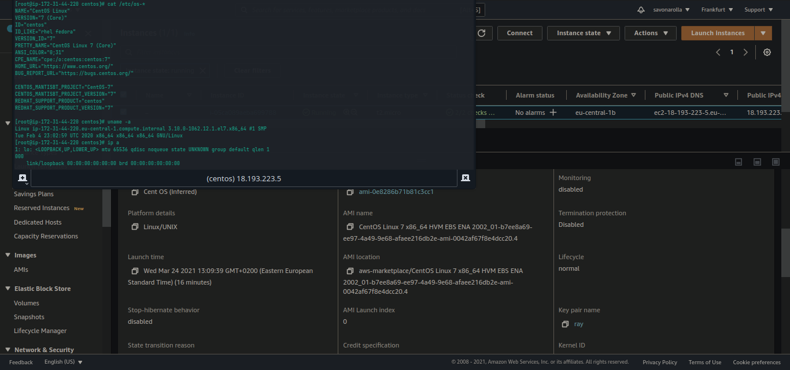

 # 6. Create a snapshot of your instance to keep as a backup.

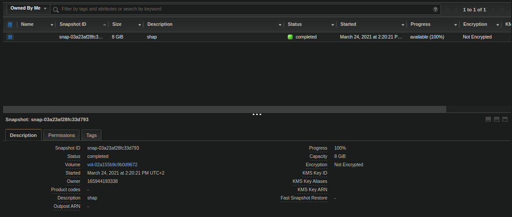

# 7. Create and attach a Disk_D (EBS) to your instance to add more storage space. Create and save some file on Disk_D..

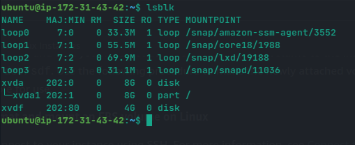
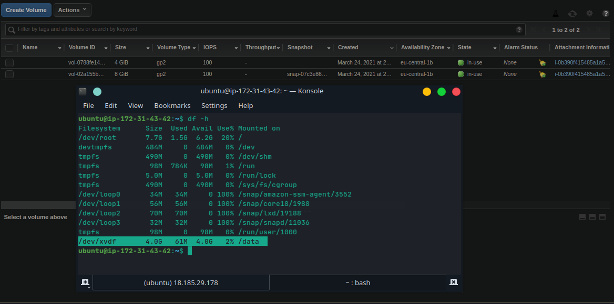
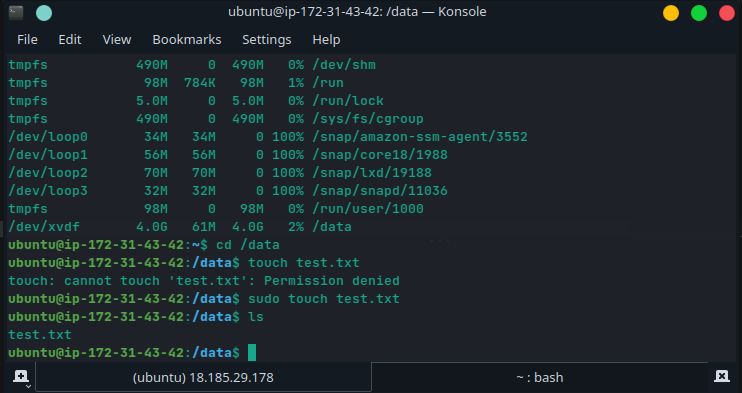

# 8. Launch the third instance from backup.

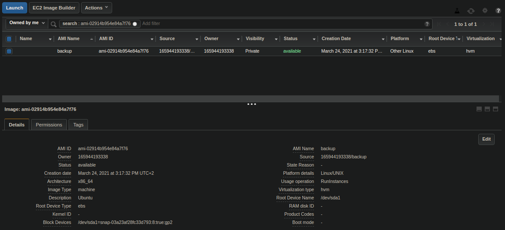

# 9. Detach Disk_D from the 2nd instance and attach disk_D to the new instance.

I am sorry. Can't remember now why I didn't do that. 

# 10. Launch and configure a WordPress instance with Amazon Lightsail link
 
 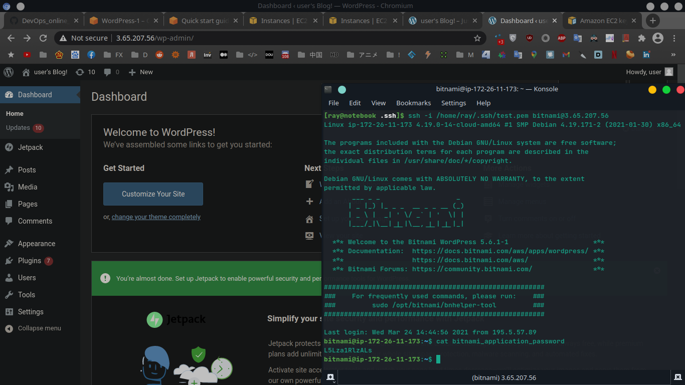

 # 11. Review the 10-minute example Store and Retrieve a File. Repeat, creating your own repository..

 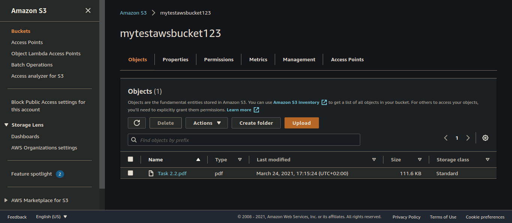

# 12. Review the 10-minute example Batch upload files to the cloud to Amazon S3 using the AWS CLI. Create a user AWS IAM, configure CLI AWS and upload any files to S3..

Same as 11 ? Sorry.

# 13. Review the 10-minute example. Explore the possibilities of creating your own domain and domain name for your site..
 
I already have my own domain.

 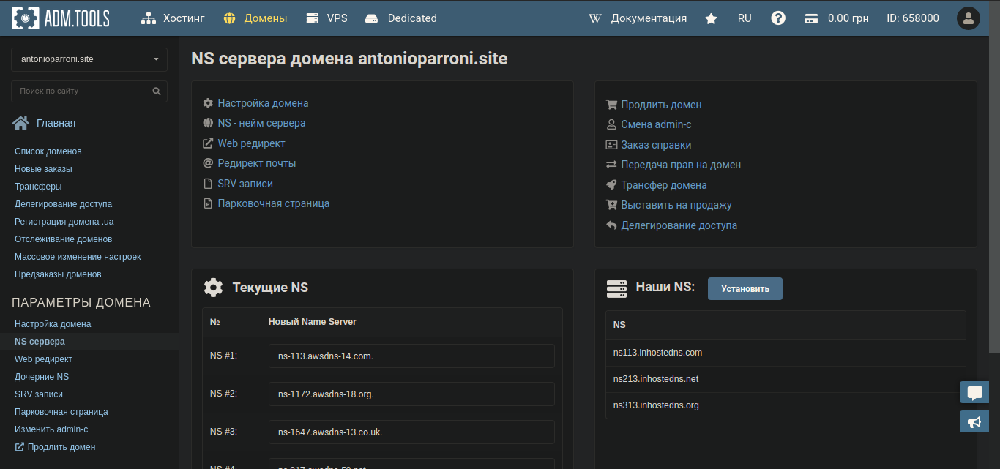

# 14. Review the 10-minute example Deploy Docker Containers on Amazon Elastic Container Service (Amazon ECS). Repeat, create a cluster, and run the online demo application or better other application with custom settings.

  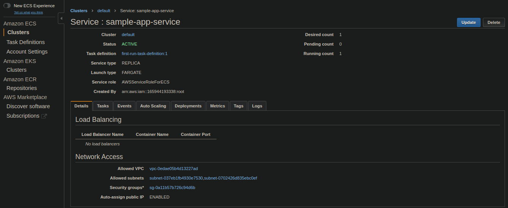
  It wasn't so simple, yeah ? 

  # 15. Create a static website on Amazon S3, publicly available (link1 or link2 - using a custom domain registered with Route 53). Post on the page your own photo, the name of the educational program (EPAM DevOps online Winter 2020/2021), the list of AWS services with which the student worked within the educational program or earlier and the full list with links of completed labs (based on tutorials or qwiklabs or re:Invent 2020). Provide the link to the website in your report..

 It should work...
 http://myexamplehosting.s3-website.eu-central-1.amazonaws.com/

 And maybe it could work right now even with my own domain. 
 http://www.antonioparroni.site/

  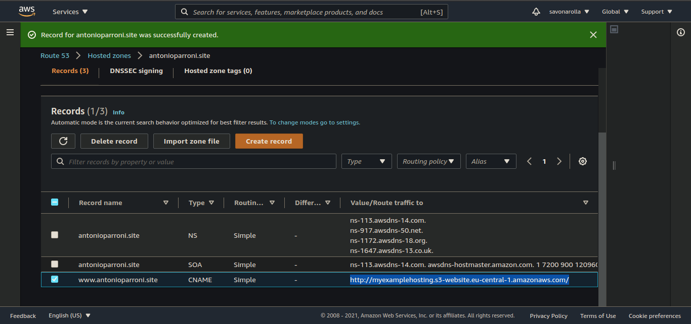

  P.S. The content of my S3 bucket is still in progress...

