 ## Module 3 Database Administration

# 2. Install MySQL server on VM.

I decided to make it a little bit harder. I'm running it inside Docker on Linux :)


UPD: Wait! It's not MSSQL. It's MySQL.. eh.. I need to get some sleep. Will come back ASAP

UPDD: Teacher said that MSSQL is also okay. Will continue with it, in Docker. 

# 2.1 Opened my container to the web, to install mssql-cli for a better console output. 
Installation
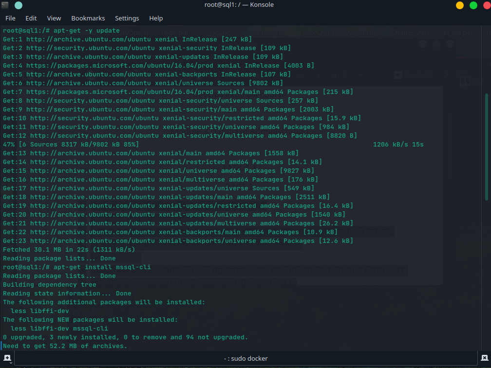
Running!
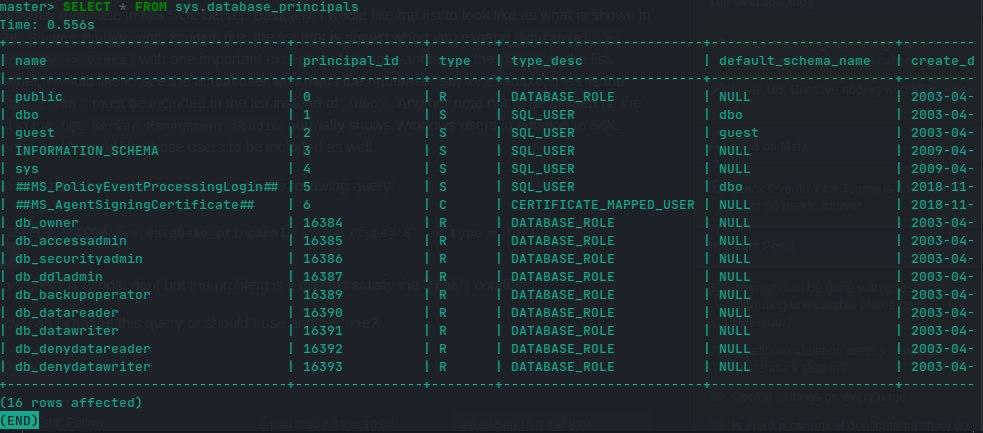

# 3. Select a subject area and describe the database schema, (minimum 3 tables)

Using my old schema for a database idea. 

# 4. Create a database on the server through the console.
Clear database 
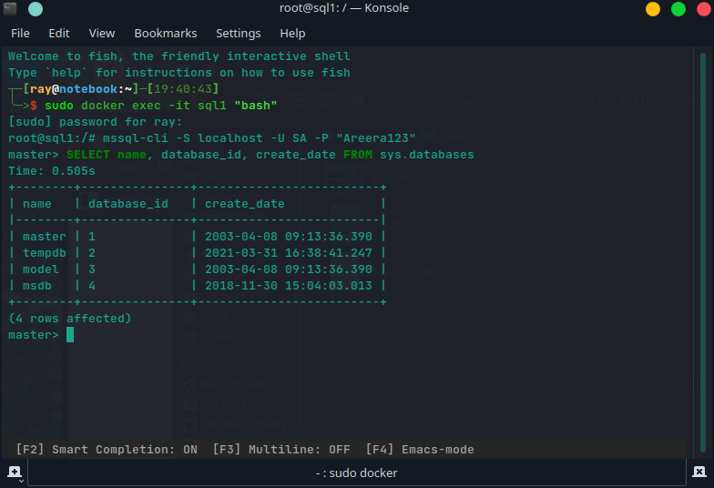

My query for the database creation
```
 use master
 go
 create database Music_Collection
 go
 use Music_Collection
 go
  create table Music_Disk
 (
     music_disk_id int primary key identity,
     name nvarchar(30),
     release_date date,
     genre_id int,
     singer_id int,
     publisher_id int,
 )
 go

 create table Genre
 (
     genre_id int primary key identity,
     name nvarchar(20)
 )
 go

 create table Publisher
 (
     publisher_id int primary key identity,
     name nvarchar(30),
     country nvarchar(20)
 )
 go

 create table Singer
 (
     singer_id int primary key identity,
     name nvarchar(50)
 )
 go

 create table Song
 (
     song_id int primary key identity,
     name nvarchar(30),
    duration time,
     disk_id int,
     genre_id int,
     singer_id int
 )

 alter table Music_Disk
 add foreign key (genre_id) references Genre(genre_id),
 foreign key (singer_id) references Singer(singer_id),
  foreign key (publisher_id) references Publisher(publisher_id)
 go

 alter table Song
 add foreign key (disk_id) references Music_Disk(music_disk_id),
     foreign key (genre_id) references Genre(genre_id),
     foreign key (singer_id) references Singer(singer_id)
 go


use Music_Collection
go
```
Created DB 
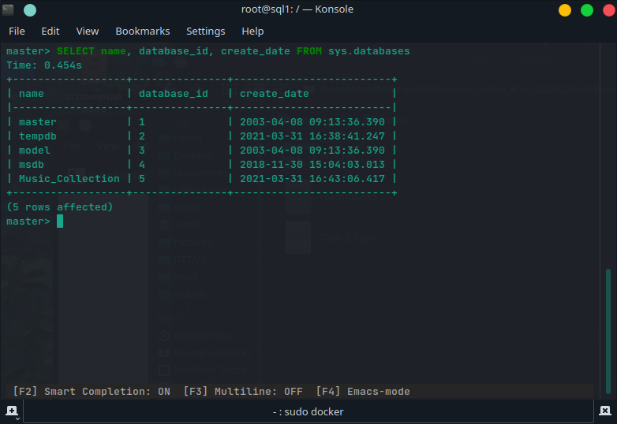


# 5.Fill in tables.
Query for filling
```
USE Music_Collection 
INSERT INTO Genre VALUES (N'Rock') 
GO
INSERT INTO Publisher VALUES (N'UKF',N'UK'), (N'Ultra Records', N'USA'), (N'Grammy', N'USA')  
GO 
INSERT INTO Singer VALUES (N'Blue Stahli'), (N'AC/DC'), (N'Disturbed'), (N'Europe')
GO
INSERT INTO Song VALUES (N'Final Cooldown', '00:03:20', null,1,4) 
GO
```

# 6. Construct and execute SELECT operator with WHERE, GROUP BY and ORDER BY.

```
USE Music_Collection 
SELECT Name FROM Publisher WHERE Country = 'USA'  
```
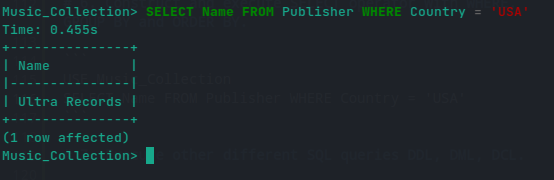


```
USE Music_Collection 
SELECT Name FROM Singer ORDER BY singer_id desc  
```
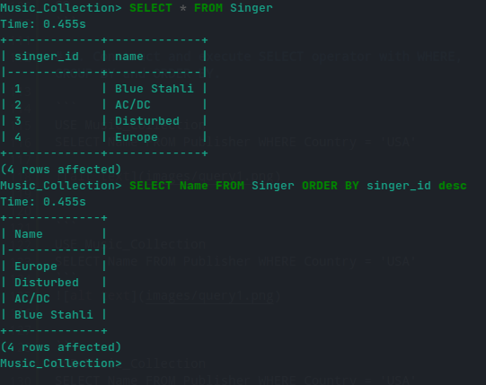


```
SELECT country, COUNT(*) FROM Publisher GROUP BY country 
```
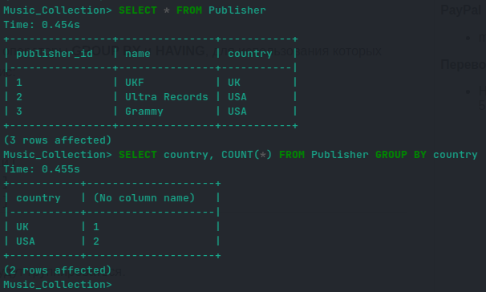

# 7. Execute other different SQL queries DDL, DML, DCL.
- DDL 
```
ALTER TABLE Singer ADD birth_country VARCHAR(20) NULL
```
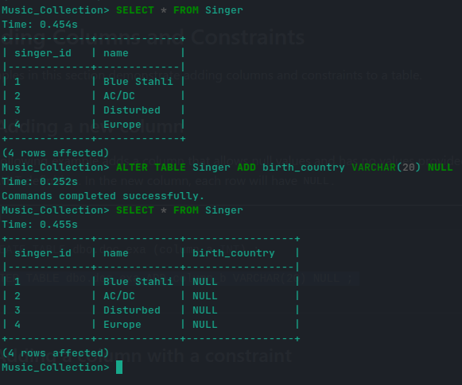

- DML 
```
DELETE FROM Publisher WHERE country = 'UK' 
```
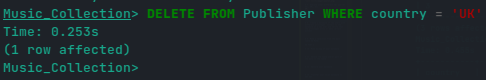

- DCL 
```
GRANT SELECT, INSERT, UPDATE, DELETE ON Song TO Ray
```
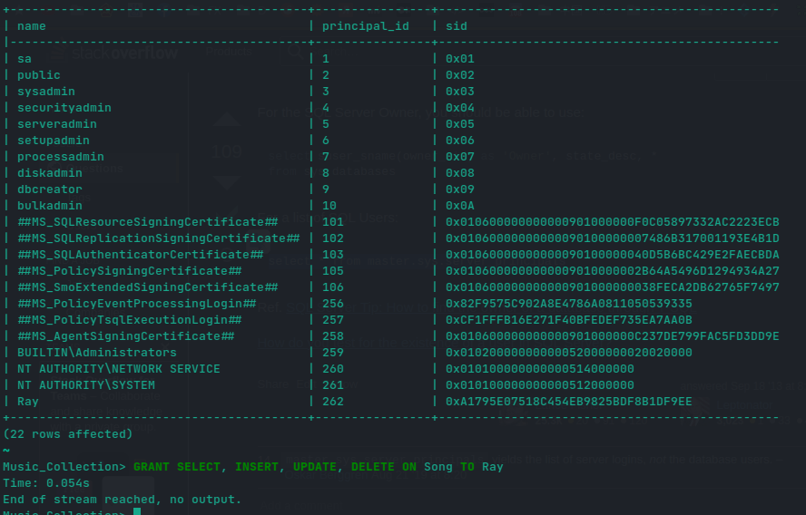


# 8. Create a database of new users with different privileges. Connect to the database as a new user and verify that the privileges allow or deny certain actions.

```
USE master
GO
CREATE LOGIN TestDevOps  WITH PASSWORD = 'SomethingSimple123';
GO
USE Music_Collection;
GO
CREATE USER Anton FOR LOGIN TestDevOps WITH DEFAULT_SCHEMA = Song;
GO
GRANT SELECT on Song to Anton
GO
REVOKE DELETE ON Song to Anton

```

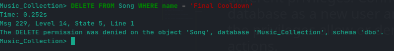

# 9. Make a selection from the main table DB MySQL.

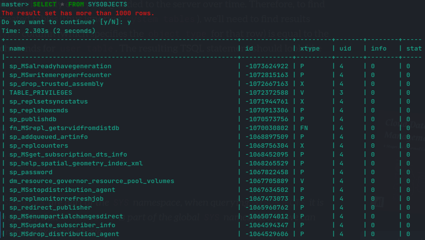

## PART 2

# 10. Make backup of your database.

```
BACKUP DATABASE Music_Collection 
    TO DISK = '/backup/test.bak'  
    WITH FORMAT, 
    MEDIANAME = 'SQLServerBackup', 
    NAME = 'Full Backup of SQLTestDB'; 
GO
```

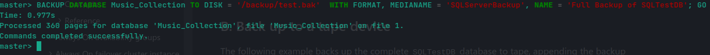
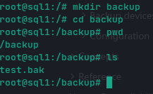


# 11. Delete the table and/or part of the data in the table.

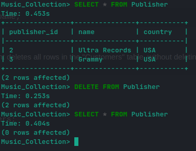


# 12. Restore your database.

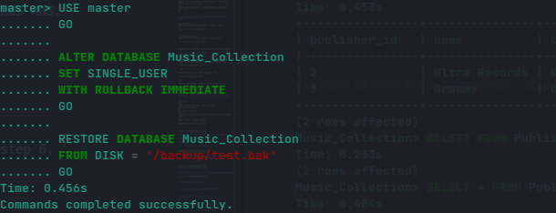

# 13. Transfer your local database to RDS AWS.

```
docker cp sql1:/backup/test.bak /home/ray/Desktop/backup
```

# 14. Connect to your database.

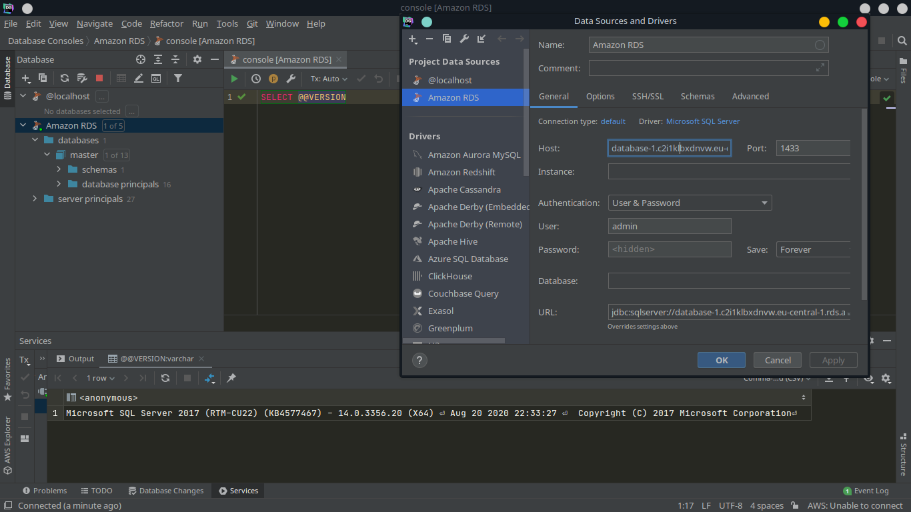

OMG! Finally I fugured it out. It was all about VPC security policy.. Jesus.. it took me quite a bit :(

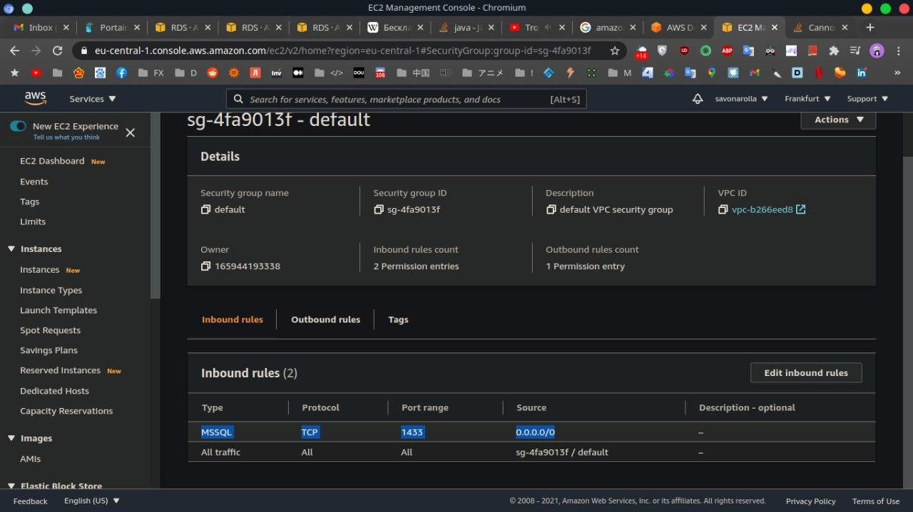

# 15. Execute SELECT operator similar step 6.

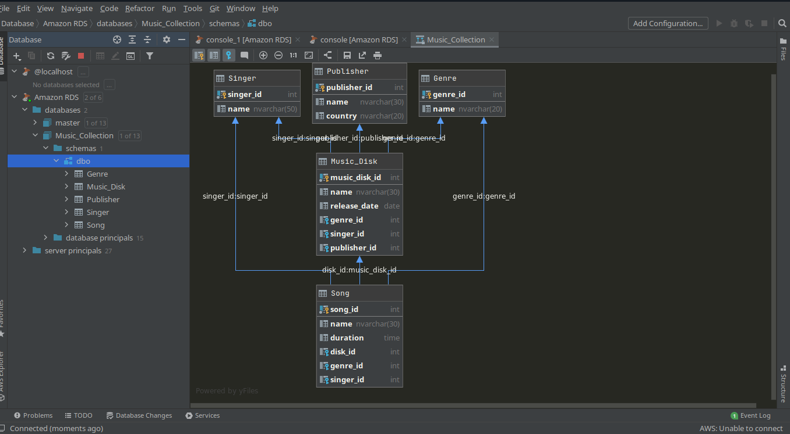

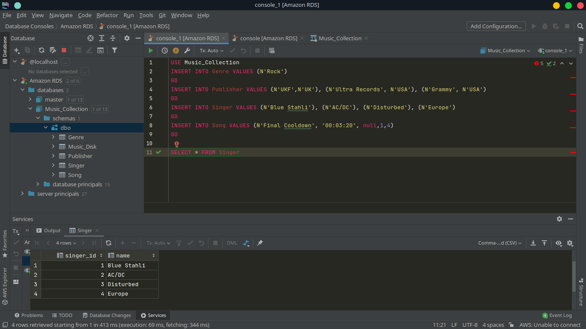

# 16. Create the dump of your database.

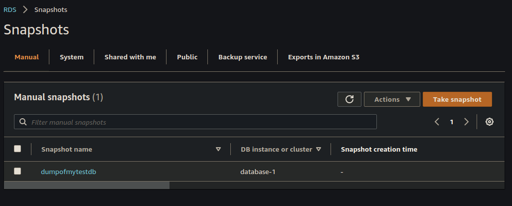

PS. Will try later to understand how to dump it on a AWS Bucket. A little bit confused with IAM policy and RDS association to it.

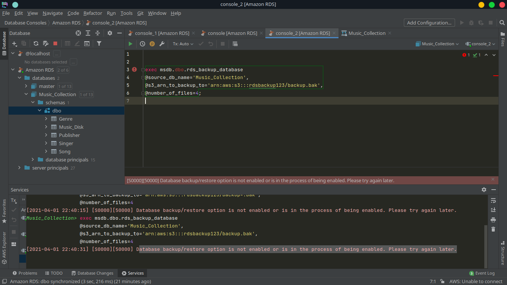

## PART 3

# 17. Create an Amazon DynamoDB table.

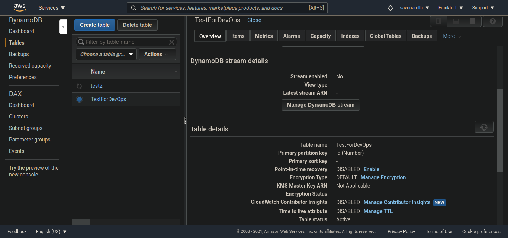

# 18. Enter data into an Amazon DynamoDB table.

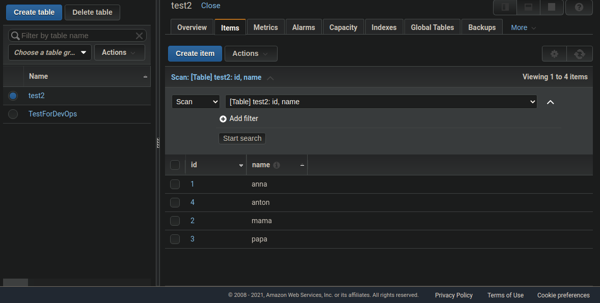

# 19. Query an Amazon DynamoDB table using Query and Scan.

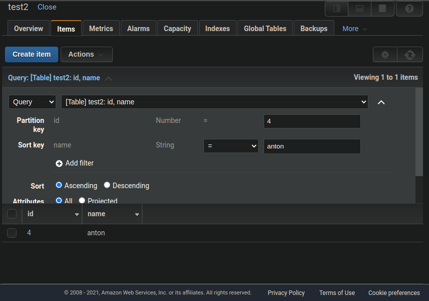
PS. It's not a right schema. Am I right ? 