## DevOps external course
## Module 4 Networking Fundamentals
## TASK 4.1

# 1. Зібрати наступний проект (рис 1), який містить в собі: 4 ПК типу PC-PT, Концентратор (Hub-PT). Кожен комп'ютер повинен бути з'єднаний з концентратором за допомогою крученої пари (Copper Straight-through).

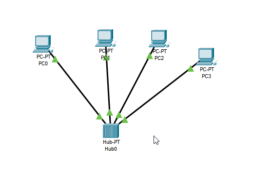

# 2. Зберегти проект і його скріншот.

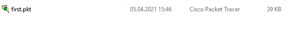

# 3. Кожному ПК привласнити унікальну IP адресу. Для її призначення необхідно зайти в меню конфігурації ПК шляхом одноразового клацання по ньому лівою кнопкою миші і вибору вкладки Config / Interface. В полі ip address необхідно ввести відповідну адресу, а в полі Subnet Mask - відповідно цьому адресу маску (рис. 2).

Done.

# 4. Перевірити працездатність отриманої мережі шляхом здійснення Інтернет запитів (ICMP пакетів) від одного ПК до іншого. Для присвоєння такого пакета ПК використовуйте кнопку ADD SIMPLE PDU в правій частині робочого вікна. Після цього клацніть лівою кнопкою миші на локальну машину-джерело, потім - на машину-одержувача. Перевірити працездатність мережі.

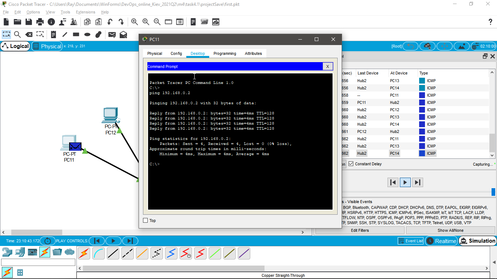

# 5. Перейти в режим Simulation і за допомогою кнопки Event List викликати вікно відображення подій в мережі Simulation Panel. Використовуючи кнопку Auto Capture / Play запустити симуляцію роботи ICMP пакетів. Простежити просування пакетів по мережі і зберегти даний скріншот.
My network works as it is expected to work. First, it sends ICMP message to the Hub, which after sends this ICMP message to all other computers connected to the network (because it's a Hub, not a Switch) The message reachers it's destination PC. 
While other computers reject it. Because the message destination MAC does not match with theirs.

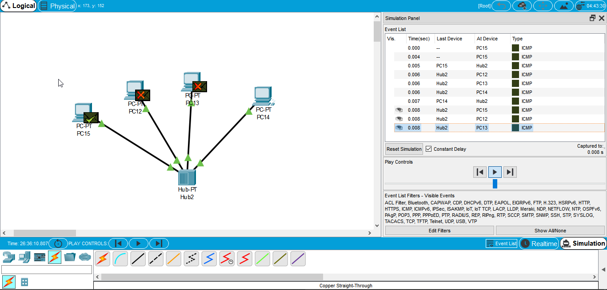

# 6. Простежити за порядком і шляхом проходження пакетів у вікні Simulation Panel (рис. 3). Зберегти даний скріншот.

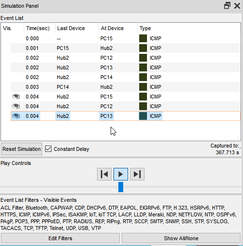

# 7. Переглянути інформацію о пакетах з вікна Simulation Panel і їх відповідність моделі OSI шляхом подвійного клацання по пакету в вікні (рис. 4). Результати зберегти як скриншот.

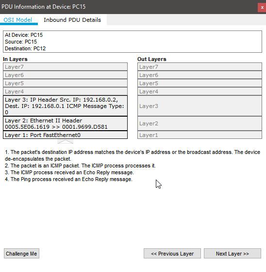

# 8. Видалити IP адреса з кожною локальною машини PC0 - PC3. Повторити пункти 5 - 10. Проаналізувати відмінності в роботі мережі.
Done.
Emm.. is it correct ? 
I don't clearly understand this task. 

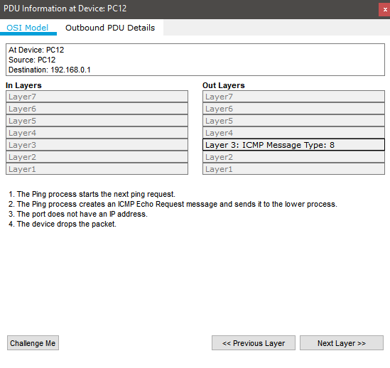

# 9. Зібрати наступний проект (рис. 5). У нього входять: PC0-PC5, Server, 2 Hubs. Однойменні пристрої з'єднуються за допомогою кросового кабелю (Copper Cross-over).

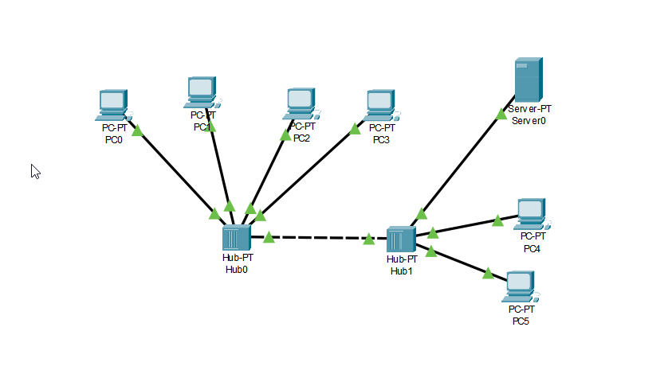

# 10. Кожному мережному компоненту привласнити IP адрес з наступної таблиці:
Okay.

# 11. Перевірити працездатність мережі.
Simple PDU (ICMP) from PC0 to the Server

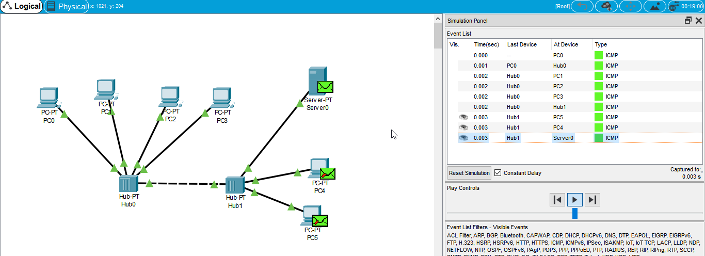

# 12. Створити новий проект, який включає в себе: 4 ПК типу PC-PT, Комутатор (Switch). Кожен комп'ютер повинен бути з'єднаний з концентратором за допомогою крученої пари (Copper Straight-through) (рис. 6).

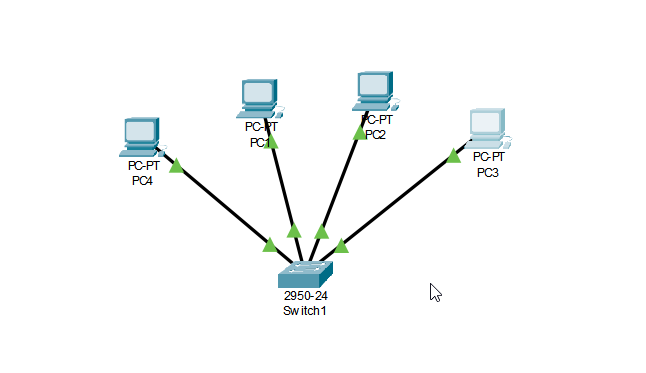

# 13. Для даної топології повторити пункти 3-9. Проаналізувати відмінності в роботі мережі Топології 1 і Топології 3.
Here we can see the difference, that this Switch sends a sample PDU (ICMP) message. 
ONLY to the specified IP/MAC address. 
Not to anyone, like Hub.

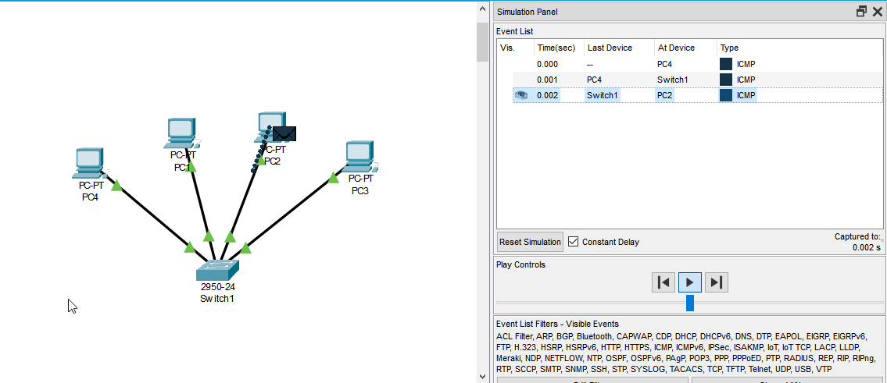

# 14. Розширити проект до такого вигляду (рис. 7). У нього входять: 8 ПК типу PC-PT, 2 комутатори (Switch). Кожен комп'ютер повинен бути з'єднаний з комутатором за допомогою крученої пари (Copper Straight-through), комутатори між собою з'єднуються за допомогою кросового кабелю (Copper Cross-over).

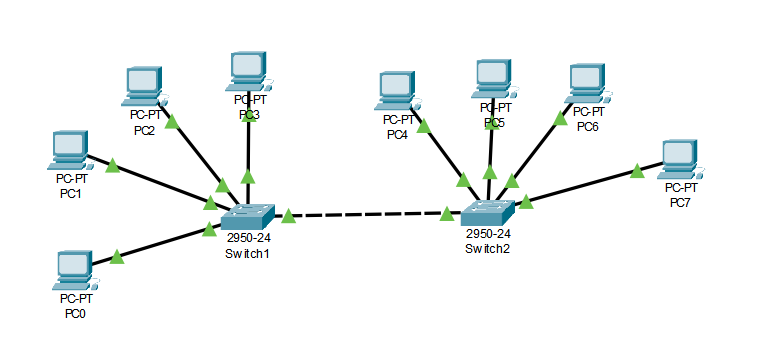

# 15. За необхідністю додати додаткові порти на комутатори. Для цього необхідно у вкладці Physical / MODULES кожного з них перетягнути доступний порт Ethernet в порожнє гніздо, попередньо вимкнувши комутатор за допомогою кнопки вимкнення.

# 16. Кожному мережному компоненту привласнити IP адрес з наступної таблиці:

Done.

# 17. Перевірити працездатність мережі.
PC0 to PC7 

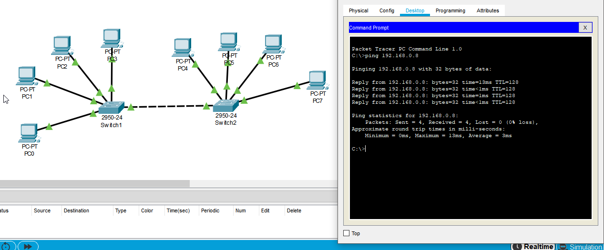

# 18. Існуючу мережу розбити на дві рівні підмережі. І з'єднати їх за допомогою маршрутизатора Router-PT з декількома портами (рис. 8). Маршрутизатор і комутатори з'єднати між собою за допомогою оптоволокна (Fiber).

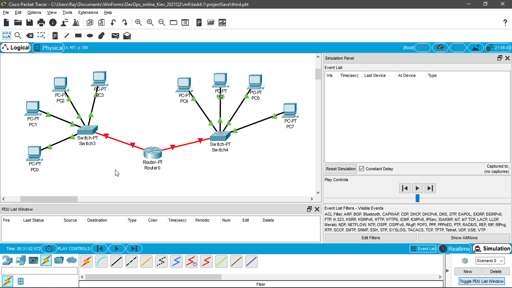

# 19. Комп'ютерам РС4 – РС7 привласнити IP адреси з наступної таблиці:

Done.

# 20. Порти маршрутизатора слід включити (On) і призначити їм IP адреси в діапазоні обраної підмережі.

Done.

# 21. На кожному з комп'ютерів (РС0 - РС7) необхідно позначити шлюз. Для його призначення необхідно зайти в меню Desktop / Ip Configuration і в полі Default Gateway ввести адресу порту маршрутизатора, через який до нього підключається підмережа, що включає даний ПК.

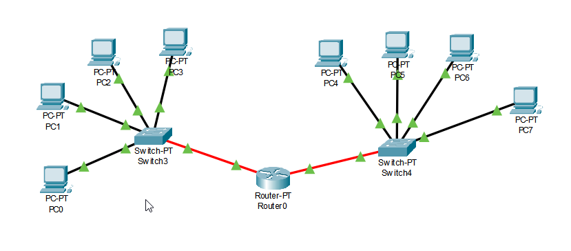

# 22. Перевірити працездатність мережі.
PC0 to PC7

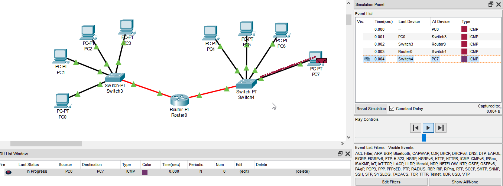

# 23. Проаналізувати відмінності в роботі мережі Топології 4 і Топології 5. Оцінити можливості, які дає використання маршрутизатора.

- Hub

    When it recives a signal from a device, it sends (transmits) that signal to all it's own devices. 

    A sends message to Z. 
    B,C,D,E,F,ect.. also recive that message.

- Switch

    An advanced version of a Hub. It controls it's own data flow, like when, where, why and ect. 
    A sends message to Z. 
    None of B,C,D,E,F recive this message. Only Z.

- Router

    A device to connect multiple networks. 
    Can send messages even to an unknown address.
    Have it's own routing table. And in fact, it looks like more that a real (small) PC. With it's own operative system and ect.