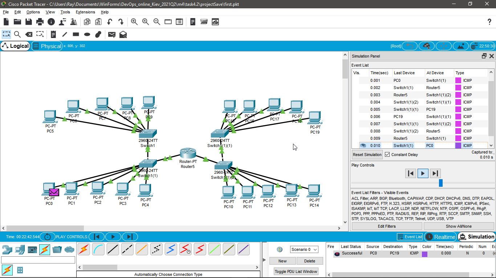
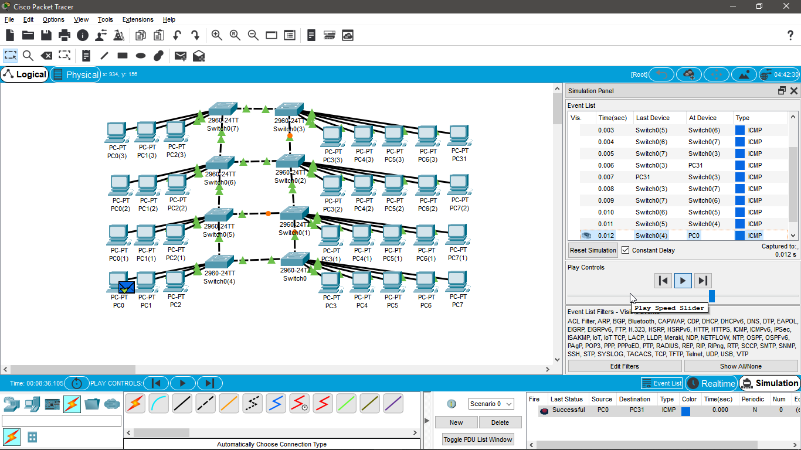
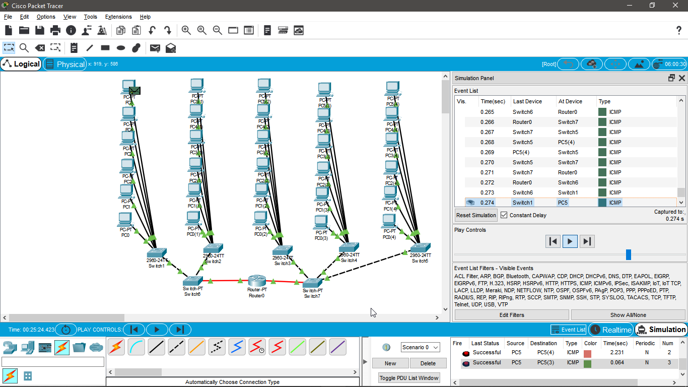

### Module - Networking Fundamentals TASK 4.2 

# Завдання 1. Необхідно змоделювати корпоративну мережу організації, яка містить 2 будинки по 2 поверхи в кожному. Горизонтальна підсистема поверху складається з однієї робочої групи по 5 комп'ютерів. Провести аналіз працездатності мережі і її трафіку.

From PC0 to PC19

ICMP request is successful

Saved in projectSave/first.pkt

# Завдання 2. Необхідно змоделювати корпоративну мережу організації, яка містить 1 будинок з чотирма поверхами. Горизонтальна підсистема поверху складається з двох робочих груп по 3 і 5 комп'ютерів відповідно. Провести логічну структуризацію мережі на 8 підмереж (відповідно до кількості робочих груп). Провести аналіз працездатності мережі і її трафіку.

From PC0 to PC31
ICMP request is successful

Saved in projectSave/second.pkt
I did it correct ? Or there was the necessity to do it with 8th routers ? 

PS. A little bit lazy to assign IP's to every PC.

# Завдання 3. Необхідно змоделювати локальну мережу комплексу з 5 одноповерхових будівель. Одна будівля - 1 робоча група по 6 комп'ютерів. Мережа будується на основі маршрутизатора з одним портом.
After the correct ARP table requests, the PDU (ICMP) messages are sent correctly.

P.S. Again, not all devices IP's are configured.
But it should work. 

Saved in projectSave/third.pkt