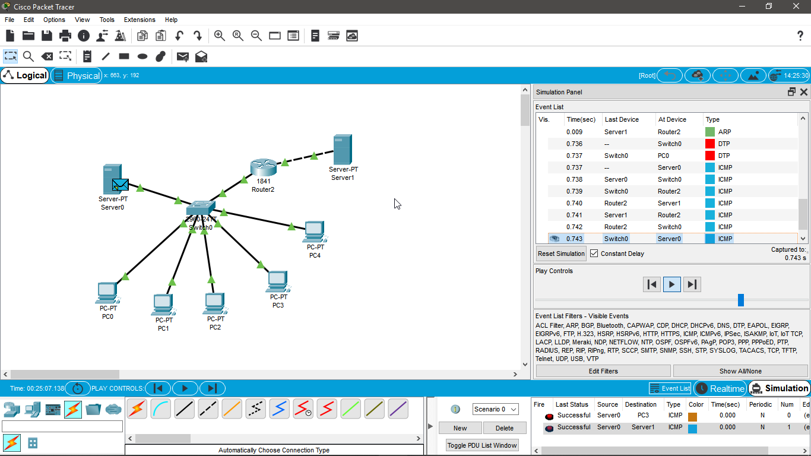
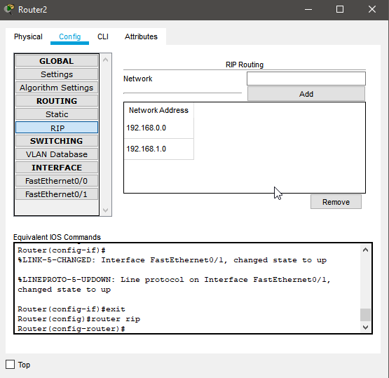

## Module - Networking Fundamentals TASK 4.3

# Завдання: Побудувати локальну мережу, що складається з сегмента на основі комутатора з 5 комп'ютерів і сервера. Комутатор з'єднаний з маршрутизатором, до якого також підключений сервер. Необхідно задати статичні IP адреси мережних інтерфейсів маршрутизаторів, локальних комп'ютерів і серверів. Налаштувати маршрутизацію по протоколу RIP.

i followed the guide and everything works fine.

Saved in projectSaves/first.pkt