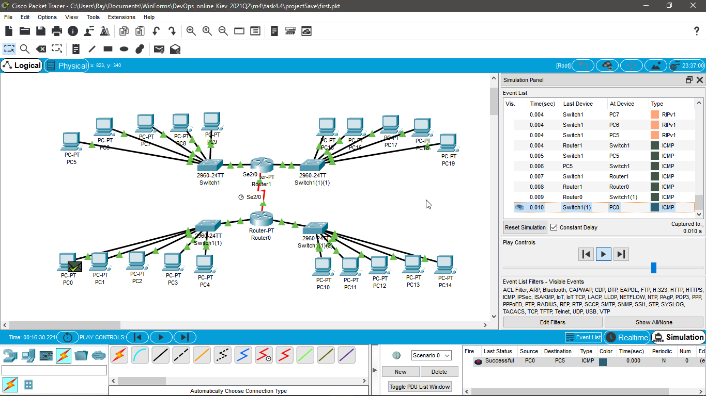

## Module - Networking Fundamentals TASK 4.4

# 1. Завдання бонусне - не обов’язкове до виконання. За основу беремо будь яке завдання task 4.2 або 4.3 і у вашу існуючу мережу додаєте роутер, так щоб їх в мережі було не менше двох. І треба налаштувати трафік між двома мережами. Якщо ж у вашій існуючій мережі вже присутньо 2 роутера і трафік налаштований, то виконання цього завдання не потрібно.

With Enabled RIP routing, I've managed to send a package to a different network. 

Saved in projectSaves/first.pkt

P.S. All devices IP's are assigned. But the RIP tables are not complete. It works anyway.