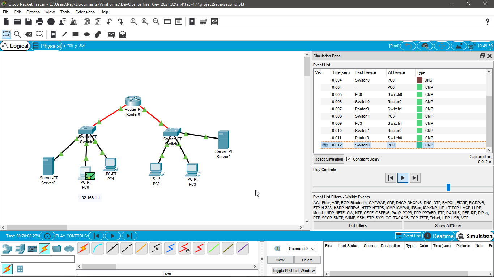
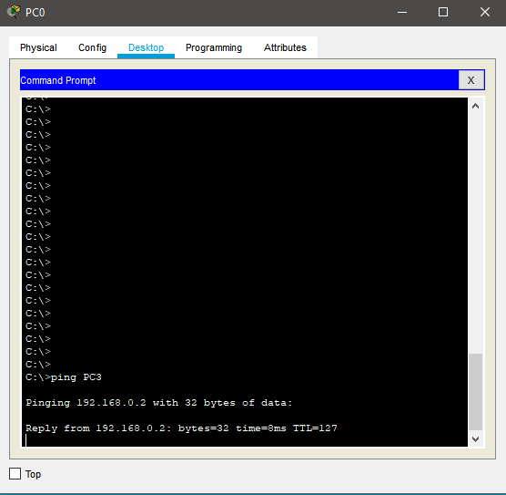
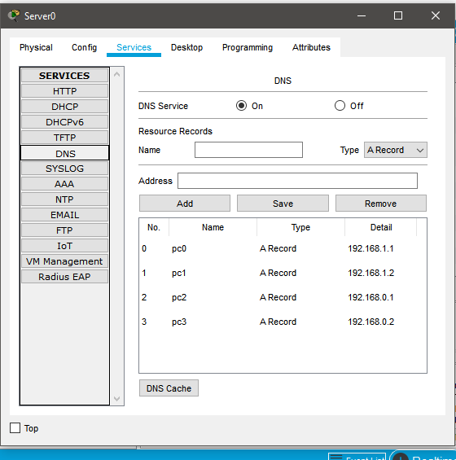
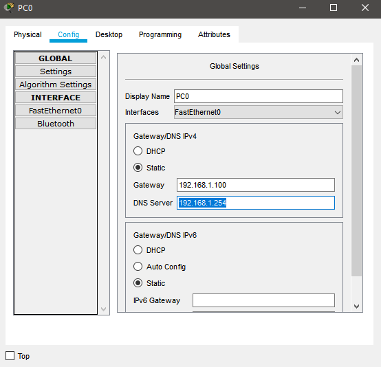

## Module - Networking Fundamentals TASK 4.4

# 1. Завдання бонусне - не обов’язкове до виконання. За основу беремо будь яке завдання task 4.2 або 4.3 і у вашу існуючу мережу додаєте роутер, так щоб їх в мережі було не менше двох. І треба налаштувати трафік між двома мережами. Якщо ж у вашій існуючій мережі вже присутньо 2 роутера і трафік налаштований, то виконання цього завдання не потрібно.

With Enabled RIP routing, I've managed to send a package to a different network. 

Saved in projectSaves/first.pkt

P.S. All devices IP's are assigned. But the RIP tables are not fully complete. But it works anyway.

# 2. Завдання бонусне - не обов’язкове до виконання. Організувати 2 підмережі. Налаштувати DNS на серверах.

Successful ping from PC0 to PC3 with DNS instead of direct IP.

Saved in projectSaves/second.ptk

PS. Everything is configured according to the picture in the task description. No white spaces. 

PSS. It was awesome to do this homework. 
Thank you, for such entertaining tasks!