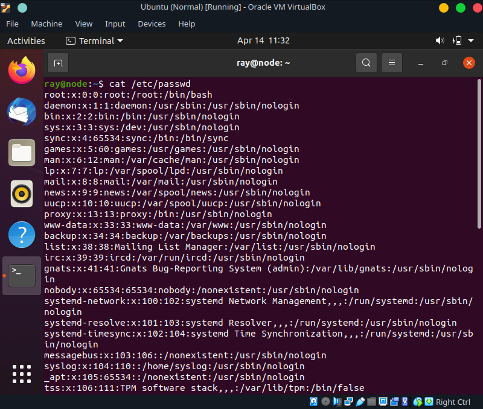
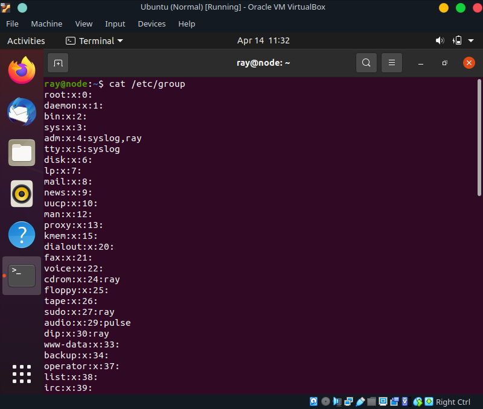
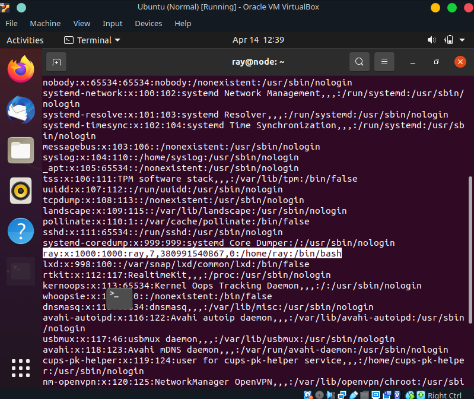
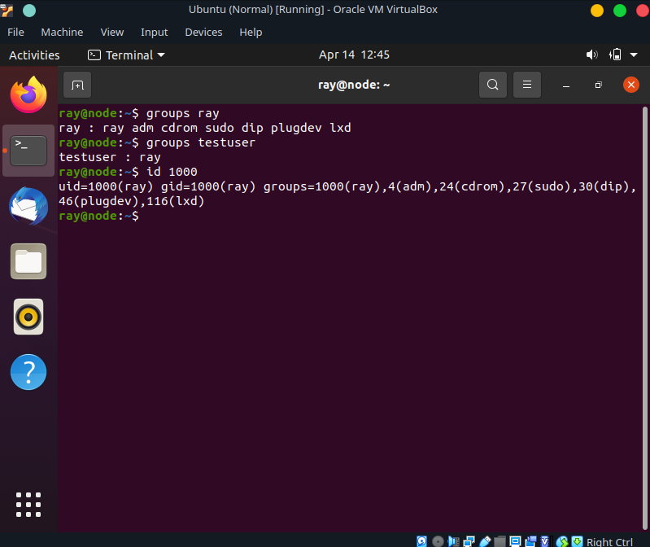
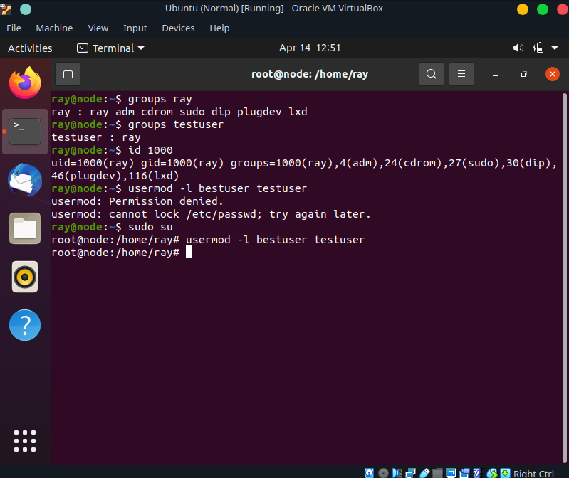
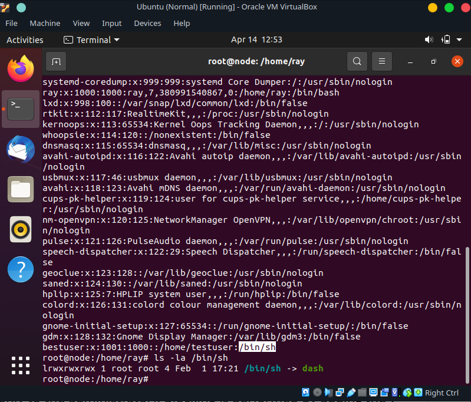
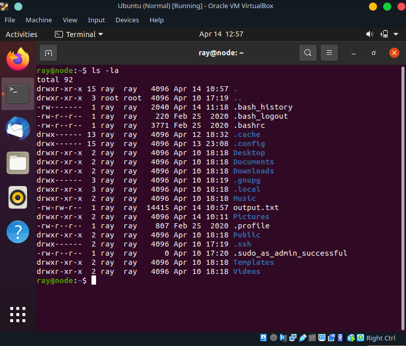
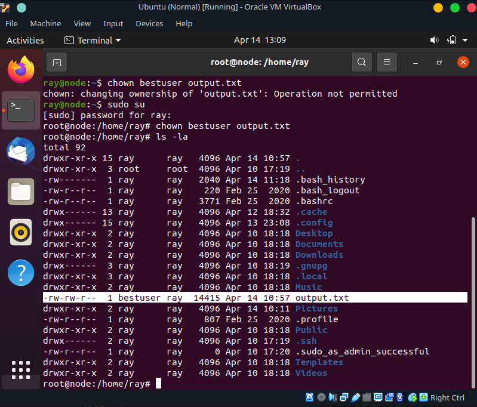
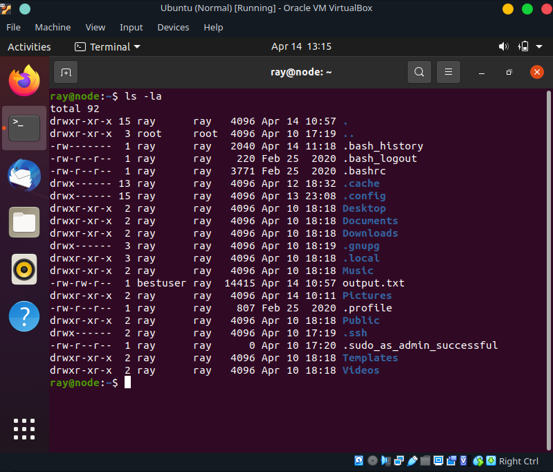
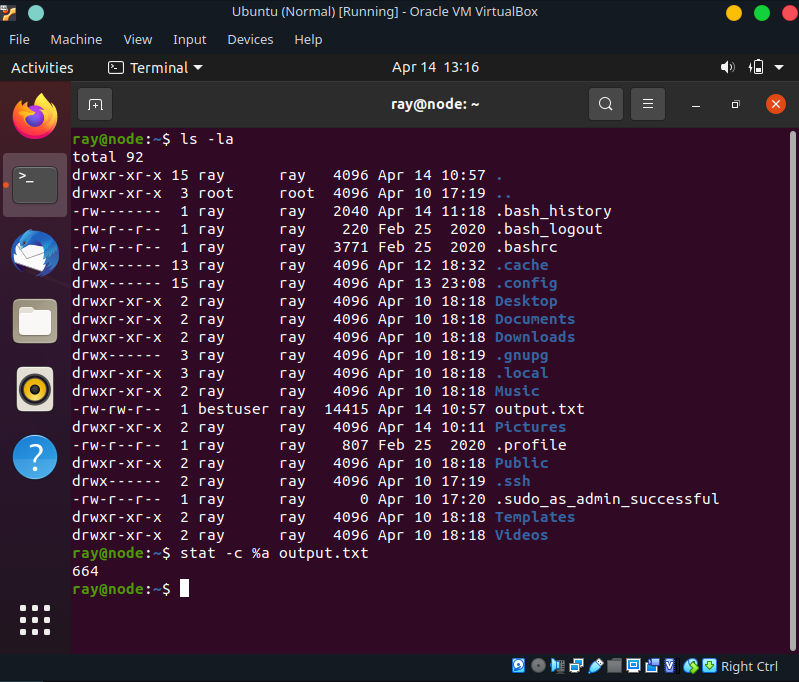

### Linux 

## Task assignment.
# 1) Analyze the structure of the /etc/passwd and /etc/group file, what fields are present in it, what users exist on the system? Specify several pseudo-users, how to define them?





# 2) What are the uid ranges? What is UID? How to define it?
UID range is in a range between 0 and 65535 (or better 2^16)
UID stands for user identifaction.
The common table is: 
- 0 -> root
- 1-999 -> daemons 
- 1000+ -> users



Ray is my user name. And my UID is 1000.

# 3) What is GID? How to define it?
Group IDentifier.

Ray is my user name. And my GID is also 1000.

# 4) How to determine belonging of user to the specific group?
With ``` group ``` command.


# 5) What are the commands for adding a user to the system? What are the basic parameters required to create a user?
``` useradd``` 

```useradd[-c uidcomment] [-d dir] [  -e expire] [-f inactive] [-g gid] [  -m [-k skel_dir]] [-s shell][-u uid[-o]] username ```

Only the username is necessary.

# 6) How do I change the name (account name) of an existing user?

```usermod```


# 7) What is shell_dir? What is its structure?
The directory of the users shell. 


# 8) How to remove a user from the system (including his mailbox)?

``` userdel[-r] username ```

# 9) What commands and keys should be used to lock and unlock a user account?

```passwd -l username```

```passwd -u username```

# 10) How to remove a user's password and provide him with a password-free login for subsequent password change?

```passwd -d username```

# 11) Display the extended format of information about the directory, tell about the information columns displayed on the terminal.

```ls -la```

Type of file, it's permission, ownership, group ownership, time of creation/modification, name and ect..

# 12) What access rights exist and for whom (i. e., describe the main roles)? Briefly describe the acronym for access rights.

rwx
- R -> Read (4)
- W -> Write (2)
- X -> Execute (1)

# 13) What is the sequence of defining the relationship between the file and the user?

```chmod ``` ?

# 14) What commands are used to change the owner of a file (directory), as well as the mode of access to the file? Give examples, demonstrate on the terminal.

``` chown ```


# 15) What is an example of octal representation of access rights? Describe the umask command.
UGO 
- USER
- GROUP
- OTHERS

777 
- (4+2+1 or rwx) for user
- (4+2+1 or rwx) for groups
- (4+2+1 or rwx) for others


# 16) Give definitions of sticky bits and mechanism of identifier substitution. Give an example of files and directories with these attributes.



```stat -c %a filename ```

# 17) What file attributes should be present in the command script?

A "shebang" == #!/bin/bash

An ``` .sh ``` extension

And of course the rights to execute it