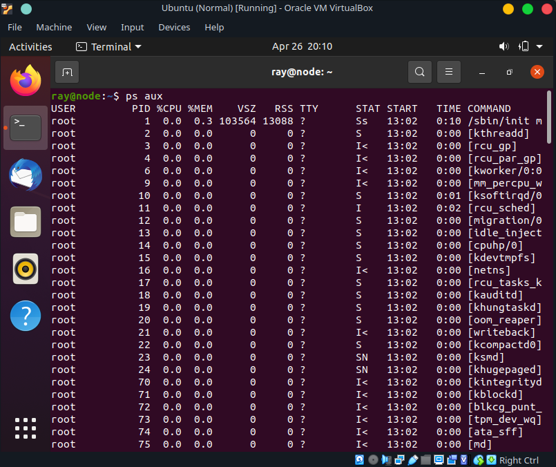

TASK5.3
Part1
# 1. How many states could has a process in Linux?

5
- R -> Running 
- S -> Sleeping, Interruptible 
- D -> Sleeping, Uninterruptible 
- T -> Stopped, or Traced 
- Z -> Zombie

# 2. Examine the pstree command. Make output (highlight) the chain (ancestors) of the current process.


# 3. What is a proc file system?

It is a special directory in UNIX system. Where system users and programms can have access to all sort of information related to computer and core state.  
It is also a virtual folder which is generated on fly. 
This approach in reciving and managing information in UNIX systems is born from main UNIX concept. Where everything is a file. 

# 4. Print information about the processor (its type, supported technologies, etc.).


# 5. Use the ps command to get information about the process. The information should be as follows: the owner of the process, the arguments with which the process was launched for execution, the group owner of this process, etc.




# 6. How to define kernel processes and user processes?

It is the same as the difference between a process and a thread. 
Every process have it's own virtual memory enviroment, while threads may share it. 

Therfore a kernel process is running only and exclusivly in the kernel assigned memory (and is unaccesible from outside) 

# 7. Print the list of processes to the terminal. Briefly describe the statuses of the processes. What condition are they in, or can they be arriving in?


We can see their status on the S collum.

# 8. Display only the processes of a specific user.


# 9. What utilities can be used to analyze existing running tasks (by analyzing the help for the ps command)?

``` ps aux ``` ? 

# 10. What information does top command display?

Current system processes. Dynamically. In real time.

# 12. Display the processes of the specific user using the top command.
``` top -u *username* ```


# 12. What interactive commands can be used to control the top command? Give a couple of examples.


# 13. Sort the contents of the processes window using various parameters (for example, the amount of processor time taken up, etc.)
``` top -o TIME+ ```


# 14. Concept of priority, what commands are used to set priority?

The main utility for this kind of operations is ``` nice ``` 

``` renice -n -*value* -p *process PID* ```


# 15. Can I change the priority of a process using the top command? If so, how?

``` top ``` followed by ```r``` (renice) and after we must insert the PID, with the next value. 

# 16. Examine the kill command. How to send with the kill command process control signal? Give an example of commonly used signals.

``` kill *PID ``` 
Sends a SIGTERM signal to the process.


# 17. Commands jobs, fg, bg, nohup. What are they for? Use the sleep, yes command to demonstrate the process control mechanism with fg, bg.
To monitor processes and redirect their input/output. 
From background to foreground and vice versa.

Fg is for foreground, while bg is for background


## Part2

# 1. Check the implementability of the most frequently used OPENSSH commands in the MS Windows operating system. (Description of the expected result of the commands + screenshots: command – result should be presented)


I also used scp copy many times before.

# 2. Implement basic SSH settings to increase the security of the client-server connection (at least


# 3. List the options for choosing keys for encryption in SSH. Implement 3 of them.


# 4. Implement port forwarding for the SSH client from the host machine to the guest Linux virtual machine behind NAT.


# 5*. Intercept (capture) traffic (tcpdump, wireshark) while authorizing the remote client on the server using ssh, telnet, rlogin. Analyze the result.
