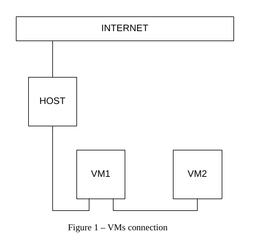
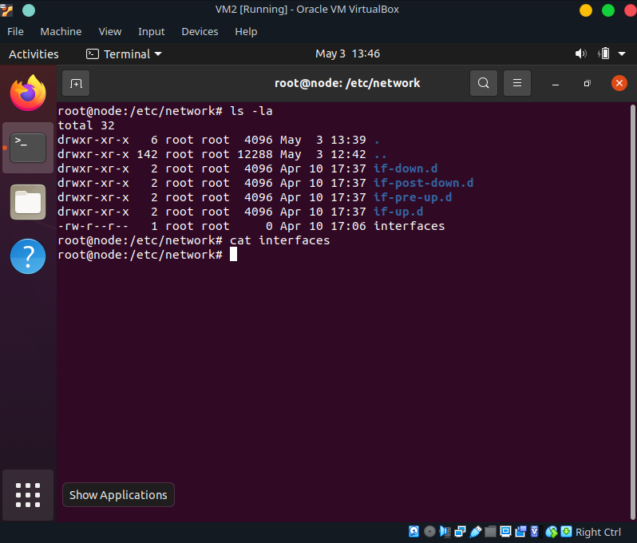
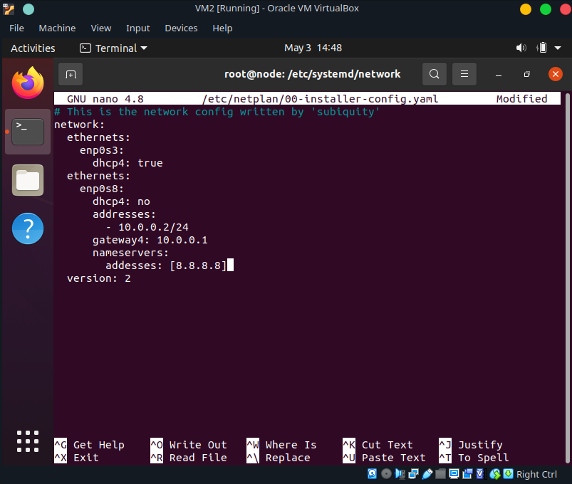
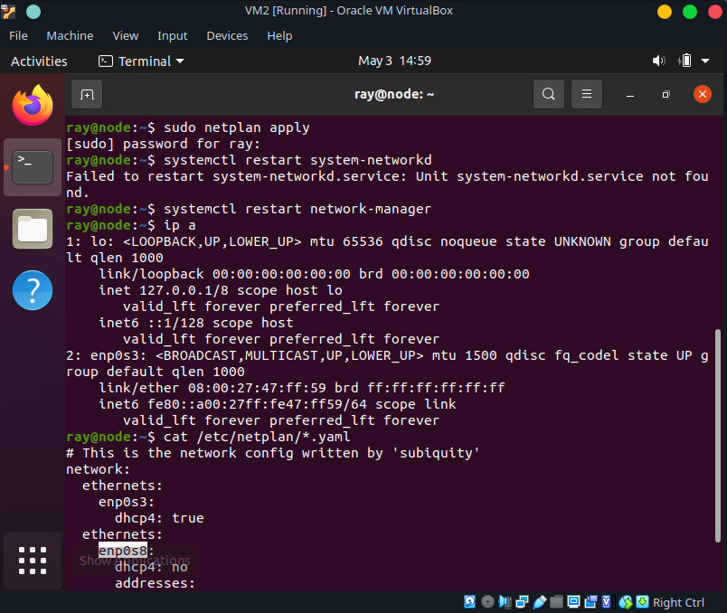
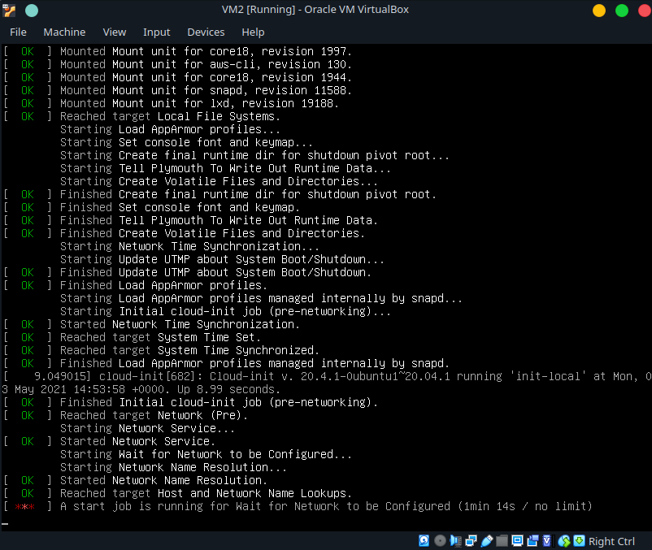
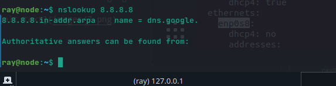
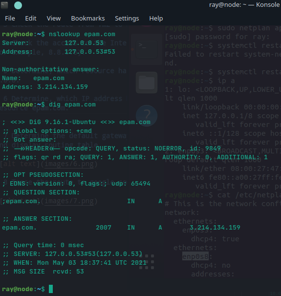
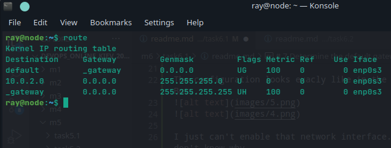
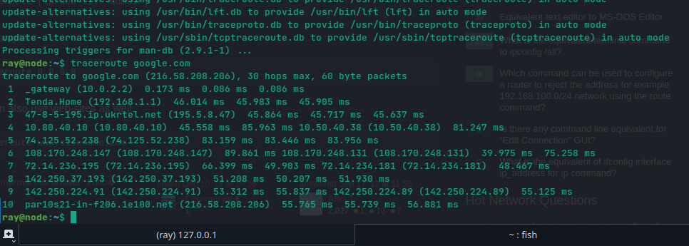

### Networking with Linux

# 1 Create virtual machines connection according to figure 1:

  

# 2 VM2 has one interface (internal), VM1 has 2 interfaces (NAT and internal). Configure all network interfaces in order to make VM2 has an access to the Internet (iptables, forward, masquerade).

I have an Ubuntu Server 20.04

No /etc/network/interfaces...

  

https://linuxconfig.org/how-to-switch-back-networking-to-etc-network-interfaces-on-ubuntu-20-04-focal-fossa-linux

Eh... it was hard.. and it took me so long..

UPD: I followed the guide step by step, but it didin't work up. I broke something. 
So I will try to make it wit NETPLAN now. 

The configuration looks exacly like in the guide. But.. 

I just can't enable that network interface. And I don't know why.

I am sorry. Really. But I guess there are no other options, then to give up on this. 
Maybe I'll download in the future an Ubuntu Server 16. Where I can configure everything according to your guide with /etc/network/interfaces

Now, I am just stuck here...

# 3 Check the route from VM2 to Host.

# 4 Check the access to the Internet, (just ping, for example, 8.8.8.8).

# 5 Determine, which resource has an IP address 8.8.8.8.

# 6 Determine, which IP address belongs to resource epam.com.

# 7 Determine the default gateway for your HOST and display routing table.

# 8 Trace the route to google.com.

