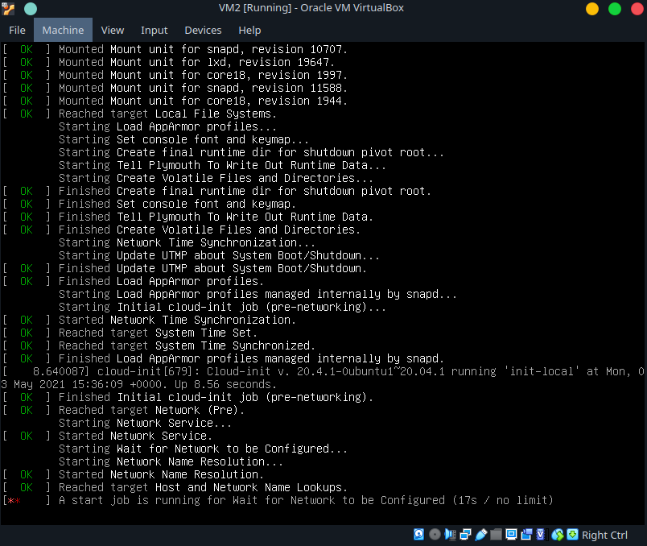

### Configuring DHCP, DNS servers and dynamic routing using OSPF protocol

# 1 Use already created internal-network for three VMs (VM1-VM3). VM1 has NAT and internal,VM2, VM3 – internal only interfaces.
  

# 2 Install and configure DHCP server on VM1. (3 ways: using VBoxManage, DNSMASQ and ISC-DHSPSERVER). You should use at least 2 of them.

# 3 Check VM2 and VM3 for obtaining network addresses from DHCP server.

# 4 Using existed network for three VMs (from p.1) install and configure DNS server on VM1. (You can use DNSMASQ, BIND9 or something else).

# 5 Check VM2 and VM3 for gaining access to DNS server (naming services).

# 6 ***Using the scheme which follows, configure dynamic routing using OSPF protocol.

  

# 7 Check results.
  